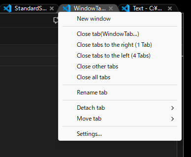
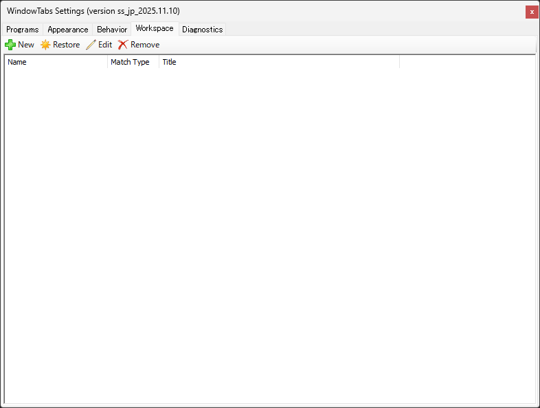

# WindowTabs

WindowTabs is a utility that brings browser-style tabbed window management to the desktop.


It was originally developed by Maurice Flanagan in 2009 and was back then provided as a free and paid version. The author has now open-sourced the utility. The original repository here: https://github.com/mauricef/WindowTabs : 404 Not Found

And Mr./Ms. redgis forked and migrated to VS2017 / .NET 4.0. The forked repository here: https://github.com/redgis/WindowTabs : 404 Not Found

And Mr./Ms. payaneco forked the source code. See the repositories here:
- https://github.com/payaneco/WindowTabs
- https://github.com/payaneco/WindowTabs/network/members
- https://ja.stackoverflow.com/a/53822

And Mr./Ms. leafOfTree also forked the source code. See the repositories here:
- https://github.com/leafOfTree/WindowTabs
- https://github.com/leafOfTree/WindowTabs/network/members

And I (Satoshi Yamamoto@standard-software) also forked the source code and compiled it with VS2022 Community Edition.

## Features

### Browser-style Tabs for Desktop Windows

WindowTabs runs in the background and adds browser-like tabs to your desktop windows, allowing you to group related windows together for better organization and productivity.

### Multi-Language Support

- English and Japanese language support
- Runtime language switching without restart
- Switch languages via tray menu


### Tab Management

- **Tab Context Menu**: Right-click on tabs to access various options
  - Close tabs (this tab, tabs to the right, tabs to the left, other tabs, all tabs)
  - New window
  - Tab width control (narrow/wide)
  - Rename tab
  - Detach tab
  - Move tab to other groups
  - Settings


### Tab Detach Functionality

Detach tabs from groups with multi-display support:
- Detach at same position
- Move to display edges (right/left/top/bottom)
- DPI-aware percentage-based positioning for correct placement across different DPI displays


### Move Tab Between Groups

Transfer tabs between different window groups:
- Shows other groups with tab names
- Adaptive tab name truncation
- Display application icons for easy identification


### Menu Dark Mode

- Dark mode support for popup menus
- Toggle via "Menu Dark Mode" checkbox in Appearance settings
- Applies to tab context menu and drag-and-drop menus



### Multi-Display and DPI Support

- Multi-display support with proper window positioning
- DPI-aware window placement
- Automatic window resizing when dropped to prevent exceeding monitor dimensions

### Tab Drag and Drop

- Drag tabs to reorder within the same group
- Drag tabs to separate into new windows with preview
- Drop windows to create new tab groups
- Respects tab alignment settings (left/center/right)

### UWP Application Support

- Supports UWP (Universal Windows Platform) applications
- Automatically handles UWP window Z-order for proper tab visibility
- Maintains tab visibility when working with UWP apps

## Settings

Access settings by right-clicking the tray icon and selecting "Settings" or by right-clicking on a tab and selecting "Settings...".

### Programs Tab

Configure which programs should use tabs and auto-grouping behavior.


### Appearance Tab

Customize the visual appearance of tabs:
- Height, width, and overlap settings
- Border and text color
- Background colors (active, normal, highlight, flash)
- Color theme presets (Light Color, Dark Color, Dark Blue Color)
- Distance from edge settings


### Behavior Tab

Configure tab behavior:
- Tab position (left/center/right)
- Tab width (narrow/wide) default
- Hide tabs when positioned at bottom (never/maximized only/always/double-click)
- Delay before hiding tabs
- Auto-grouping settings
- Hotkey settings (Ctrl+1...+9 for tab activation)
- Mouse hover activation


### Workspace Tab

Manage saved window workspaces for quick restoration.


### Diagnostics Tab

View diagnostic information and access troubleshooting tools.



## Download

<a href="https://github.com/standard-software/WindowTabs/releases"></a>

You can download prebuilt files from the [releases](https://github.com/standard-software/WindowTabs/releases) page.

Two download options are available:

- **WtSetup.msi** - Windows Installer package with automatic installation and uninstallation support
- **WindowTabs.zip** - Portable version that can be extracted and run from any location

You can also compile the `exe` file yourself as described in the [Compilation](#compilation) section below.

## Installation

### Using the MSI Installer (WtSetup.msi)

1. Download `WtSetup.msi` from the [Releases](https://github.com/standard-software/WindowTabs/releases) page
2. Run the installer and follow the installation wizard
3. Choose the installation directory (default: Program Files\WindowTabs)
4. A desktop shortcut will be created automatically
5. Optionally launch WindowTabs at the end of installation (checkbox is checked by default)

### Using the Portable Version (WindowTabs.zip)

1. Download `WindowTabs.zip` from the [Releases](https://github.com/standard-software/WindowTabs/releases) page
2. Extract the archive to your preferred location
3. Run `WindowTabs.exe`
4. WindowTabs will run in the background and add a tray icon

To run WindowTabs at startup:
- Enable "Run at startup" option in the Settings > Behavior tab

## Usage

1. Run `WindowTabs.exe`
2. Windows will automatically get tabs when grouped together
3. Right-click the tray icon to access settings
4. Right-click on tabs to access tab-specific options
5. Drag and drop tabs to organize your windows

## Version History

See [version.md](version.md) for detailed version history and changelog.

## Compilation

### Requirements

- Visual Studio 2022 Community Edition or later
- .NET desktop development workload
- F# language support

### Build Instructions

1. Open `WindowTabs.sln` in Visual Studio 2022
2. Select "Release" configuration and "Any CPU" platform
3. Build the solution (Build > Build Solution)
4. Run `deploy_release.bat` to deploy files to `exe\WindowTabs` folder

The compiled executable and required DLLs will be placed in the `exe\WindowTabs` folder.

### Building Windows Installer (MSI)

To create a Windows Installer package:

#### Requirements
- WiX Toolset v3.11 or newer (https://wixtoolset.org/releases/)
- Or WiX Toolset NuGet package (included in packages.config)

#### Build Steps


1. Build the installer:

   ```
   build_installer.bat
   ```

2. The installer will be created at:
   ```
   WtSetup\bin\Release\WtSetup.msi
   ```

## Technical Details

- Written in F# and C#
- Uses Windows Forms GUI framework
- Entry point: `WtProgram\Program.fs`
- Code-based localization system (Localization.fs, Localization_en.fs, Localization_ja-JP.fs)

## Links

### Japanese Resources

c# - WindowTabs というオープンソースを改良してみたいのですがビルドができません。何か必要なものがありますか？ - スタック・オーバーフロー
https://ja.stackoverflow.com/questions/53770/windowtabs-というオープンソースを改良してみたいのですがビルドができません-何か必要なものがありますか

全Windowタブ化。Setsで頓挫した夢の操作性をオープンソースのWindowTabsで再現する。 #Windows - Qiita
https://qiita.com/standard-software/items/dd25270fa3895365fced

## License

This project is open source. See the original repository for license information.

## Contributing

Contributions are welcome! Feel free to submit issues and pull requests.

## Credits

- Original author: Maurice Flanagan
- Fork contributors: redgis, leafOfTree, payoneco
- Current maintainer: Satoshi Yamamoto (standard-software)
