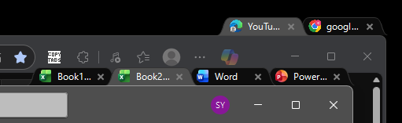
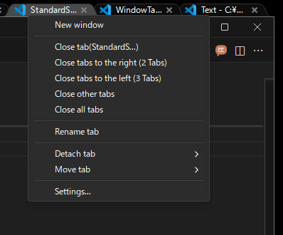
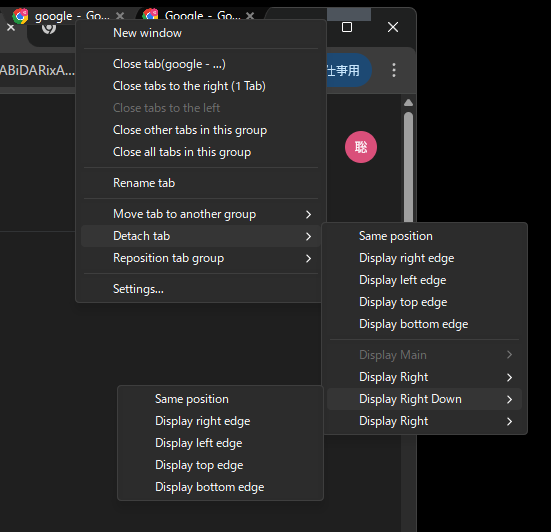
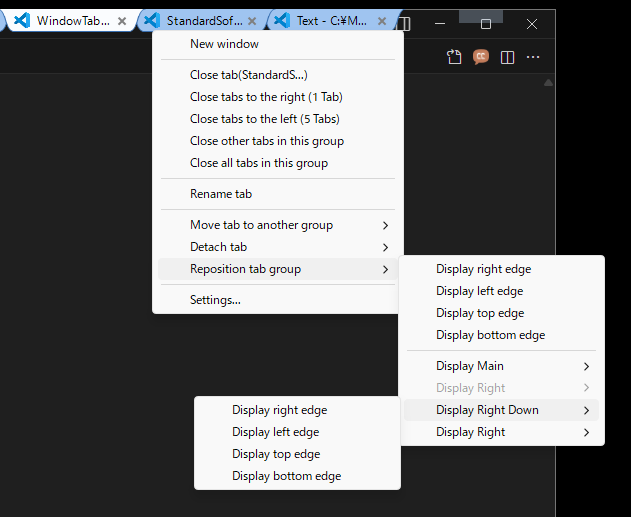
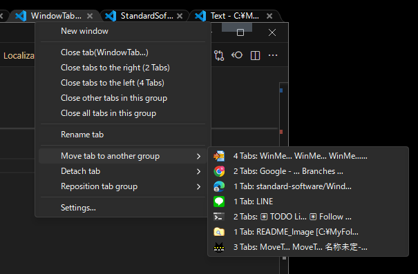
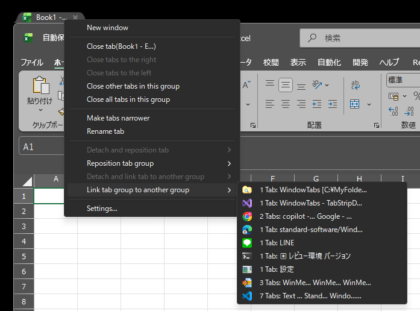
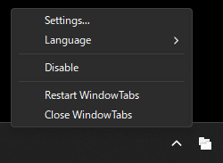
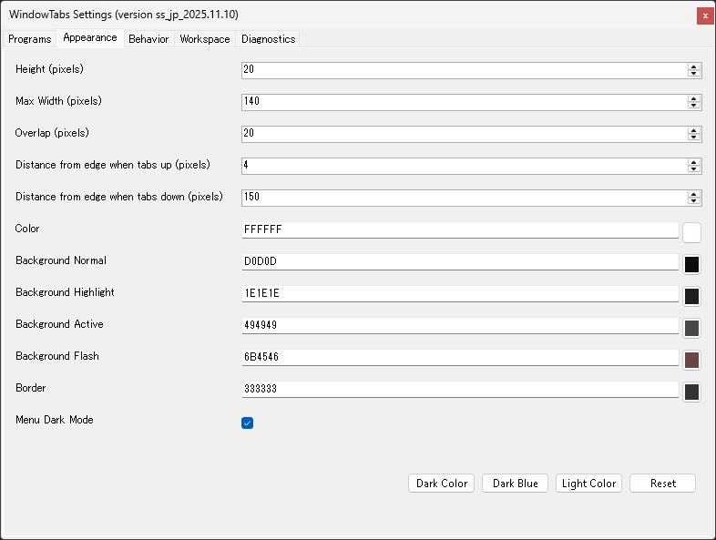
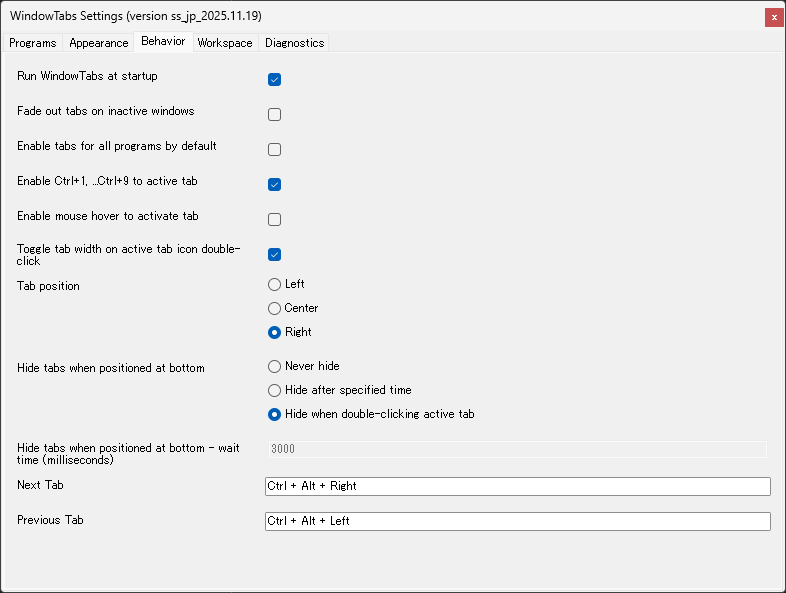

# WindowTabs

WindowTabs is a utility that enables tabbed UI for Windows applications that don't have a tab interface, as well as between different executables. You can manage Chrome and Edge with tabs, or manage multiple Excel windows or Excel and Word with tabs.

It was originally developed by Maurice Flanagan in 2009 and was back then provided as a free and paid version. The author has now open-sourced the utility. The original repository here: https://github.com/mauricef/WindowTabs : 404 Not Found

And Mr./Ms. redgis forked and migrated to VS2017 / .NET 4.0. The forked repository here: https://github.com/redgis/WindowTabs : 404 Not Found

And Mr./Ms. payaneco forked the source code from redgis. See the repository here:
- https://github.com/payaneco/WindowTabs
- https://github.com/payaneco/WindowTabs/network/members
- https://ja.stackoverflow.com/a/53822

Mr./Ms. leafOfTree also created a fork with various improvements:
- https://github.com/leafOfTree/WindowTabs
- https://github.com/leafOfTree/WindowTabs/network/members

This version (ss_jp_yyyy.mm.dd) is forked from payaneco's repository and incorporates some code implementations from leafOfTree's version. Maintained by Satoshi Yamamoto (standard-software). Can be compiled with Visual Studio 2022 or 2026 Community Edition.
- https://github.com/standard-software/WindowTabs

## Version

Latest version **ss_jp_2025.11.24**

For detailed version history and changelog, see [version.md](version.md).

## Download

**Supported OS:** Windows 10, Windows 11

You can download prebuilt files from the [releases](https://github.com/standard-software/WindowTabs/releases) page.

Two download options are available:

- **WtSetup.msi** - Windows Installer package with automatic installation and uninstallation support
- **WindowTabs.zip** - Portable version that can be extracted and run from any location

You can also build the installer and portable version yourself using the provided build scripts.

## Installation

### Using the MSI Installer (WtSetup.msi)

1. Download `WtSetup.msi` from the [Releases](https://github.com/standard-software/WindowTabs/releases) page
2. Run the installer and follow the installation wizard
3. Choose the installation directory (default: Program Files\WindowTabs)
4. Desktop shortcut and Start Menu shortcut will be created automatically
5. Optionally launch WindowTabs at the end of installation

### Using the Portable Version (WindowTabs.zip)

1. Download `WindowTabs.zip` from the [Releases](https://github.com/standard-software/WindowTabs/releases) page
2. Extract the archive to your preferred location
3. Run `WindowTabs.exe`
4. WindowTabs will run in the background and add a tray icon

To run WindowTabs at startup:
- Enable "Run at startup" option in the Settings > Behavior tab

## Usage

1. Run `WindowTabs.exe`
2. Windows will automatically get tabs when grouped together
3. Right-click the tray icon to access settings
4. Right-click on tabs to access tab-specific options
5. Drag and drop tabs to organize your windows

## Features

### Tab Drag and Drop

This feature remains unchanged from the original WindowTabs functionality.

- Drag tabs to reorder within the same group
- Drag tabs to separate into new windows with preview
- Drop windows to create new tab groups
- Respects tab alignment settings (left/center/right)

### Tab Management

- **Tab Context Menu**: Right-click on tabs to access various options
  - Close tabs (this tab, tabs to the right, tabs to the left, other tabs, all tabs)
  - New window
  - Make tabs wider / Make tabs narrower
  - Rename tab
  - Detach and reposition tab
  - Reposition tab group
  - Detach and link tab to another group
  - Link tab group to another group
  - Settings

### Detach and reposition tab

Detach a tab from group and reposition it with multi-display support:
- Detach at same position
- Move to display edges (right/left/top/bottom)
- DPI-aware percentage-based positioning for correct placement across different DPI displays

### Reposition tab group

Move entire tab group to different display positions:
- Move to current display edges (right/left/top/bottom)
- Move to other displays with edge positioning options
- DPI-aware positioning for correct placement across different DPI displays
- Maintains tab group integrity while repositioning

### Detach and link tab to another group

Detach a single tab from current group and link it to another existing group:
- Shows other groups with tab names and counts
- Adaptive tab name truncation for easy identification
- Display application icons for group recognition
- Disabled when tab group has only one tab

### Link tab group to another group

Transfer all tabs from current group to another existing group:
- Shows other groups with tab names and counts
- Transfers all tabs at once from current group to target group
- Adaptive tab name truncation for easy identification
- Display application icons for group recognition

### Menu Dark Mode / Light Mode

While light mode is the default, dark mode is also supported for context menus (popup menus) as shown in the screenshots.

- Toggle via "Menu Dark Mode" checkbox in Appearance settings
- Applies to tab context menu and drag-and-drop menus

### Multi-Display and DPI Support

- Multi-display support with proper window positioning
- DPI-aware window placement
- Automatic window resizing when dropped to prevent exceeding monitor dimensions
- Fixed tab rename floating textbox positioning on high-DPI displays

### UWP Application Support

- Supports UWP (Universal Windows Platform) applications
- Automatically handles UWP window Z-order for proper tab visibility
- Maintains tab visibility when working with UWP apps

### Multi-Language Support

- English and Japanese language support
- Runtime language switching without restart
- Switch languages via tray menu

### Disable Feature

Temporarily disable WindowTabs functionality via tray menu:
- **Disable** checkbox in tray icon context menu
- When enabled:
  - Immediately hides all existing tab groups
  - Stops automatic tab grouping for new windows
  - Disables Settings menu to prevent configuration changes

## Settings

Access settings by right-clicking the tray icon and selecting "Settings" or by right-clicking on a tab and selecting "Settings...".

### Programs Tab

This feature remains unchanged from the original WindowTabs functionality.

Configure which programs should use tabs and auto-grouping behavior.

### Appearance Tab

Customize the visual appearance of tabs:
- Height, width, and overlap settings
- Border and text color
- Background colors (active, normal, highlight, flash)
- Color theme presets (Light Color, Dark Color, Dark Blue Color)
- Distance from edge settings

### Behavior Tab

Configure tab behavior:
- Tab position (left/center/right)
- Tab width (narrow/wide) default
- Toggle tab width on active tab icon double-click
- Hide tabs when positioned at bottom (never/always/double-click)
- Delay before hiding tabs
- Auto-grouping settings
- Hotkey settings (Ctrl+1...+9 for tab activation)
- Mouse hover activation

### Workspace Tab

This feature remains unchanged from the original WindowTabs functionality.

### Diagnostics Tab

This feature remains unchanged from the original WindowTabs functionality.

## Building from Source

### Prerequisites

- Visual Studio 2022 Community Edition (or higher)
- WiX Toolset v3.11 or newer (for building the MSI installer)

### Build Scripts

Two build scripts are provided in the project root:

- **build_installer.bat** - Builds the MSI installer (WtSetup.msi)
  - Output: `exe\installer\WtSetup.msi`

- **build_release_zip.bat** - Builds the portable ZIP distribution
  - Output: `exe\zip\WindowTabs.zip`

Simply run the desired batch file to create the distribution packages.

## Links

### Japanese Resources

c# - WindowTabs というオープンソースを改良してみたいのですがビルドができません。何か必要なものがありますか？ - スタック・オーバーフロー  
https://ja.stackoverflow.com/questions/53770/windowtabs-というオープンソースを改良してみたいのですがビルドができません-何か必要なものがありますか

全Windowタブ化。Setsで頓挫した夢の操作性をオープンソースのWindowTabsで再現する。 #Windows - Qiita  
https://qiita.com/standard-software/items/dd25270fa3895365fced

## License

This project is open source. See the original repository for license information.

## Credits

- Original author: Maurice Flanagan
- Fork contributors: redgis, payaneco, leafOfTree
- Current maintainer: Satoshi Yamamoto (standard-software)

## Comments

If you have any issues, please contact us via GitHub Issues or email: standard.software.net@gmail.com

Thanks to Claude Code's hard work, development has progressed significantly. However, I've given up on making the Settings dialog dark mode-compatible as I couldn't get it to look right. I'm hoping someone might fork this project and improve it.
