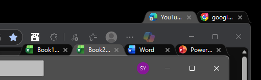
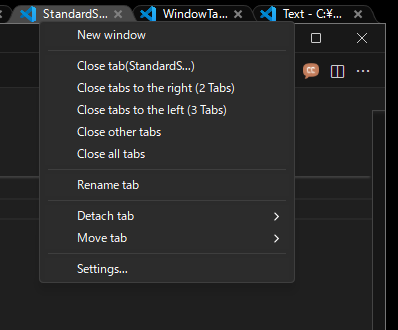
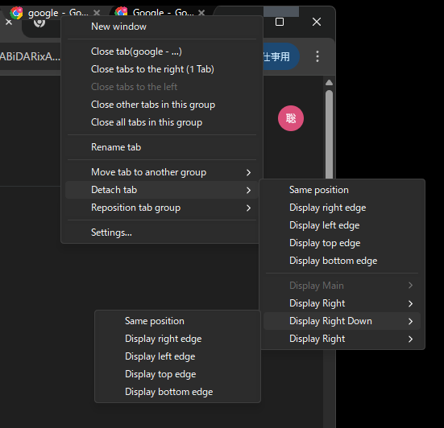
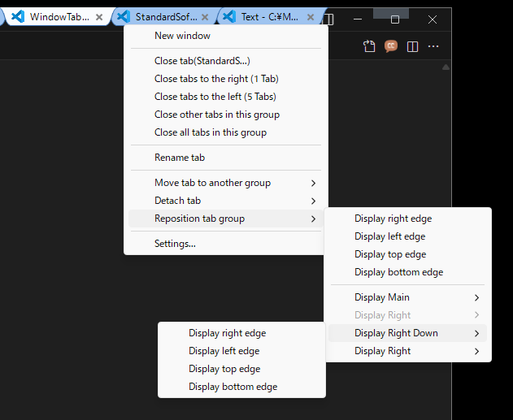
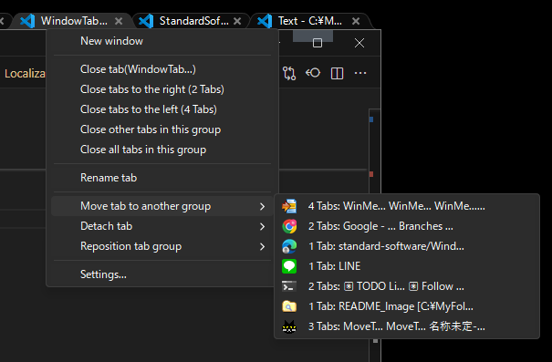
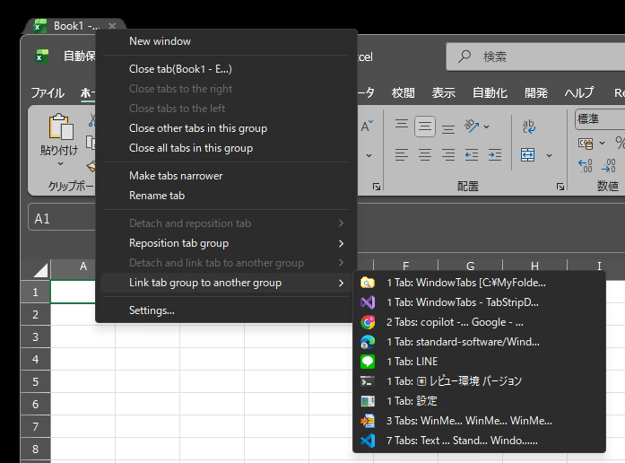
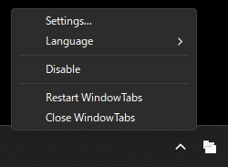
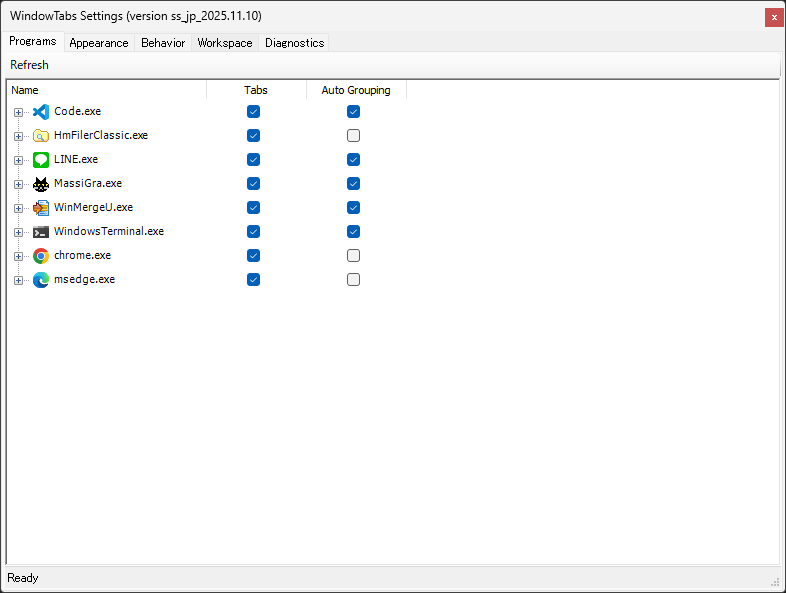
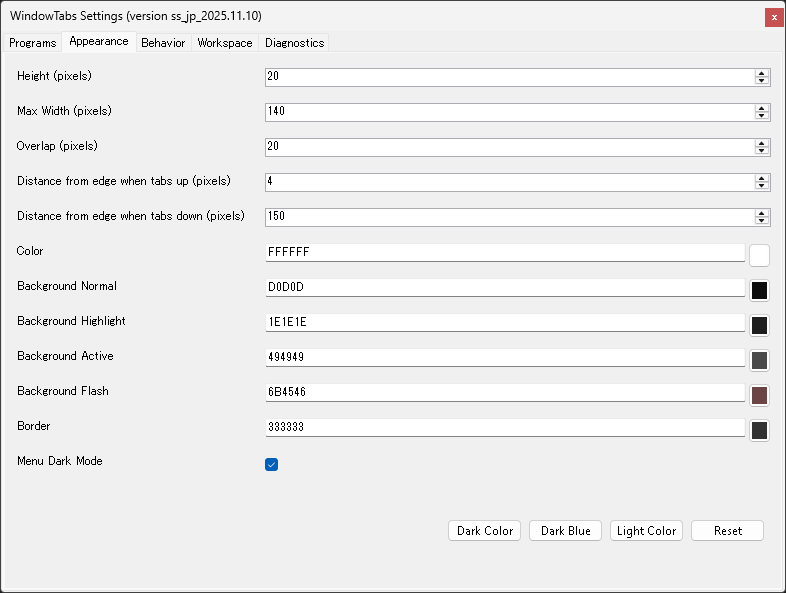
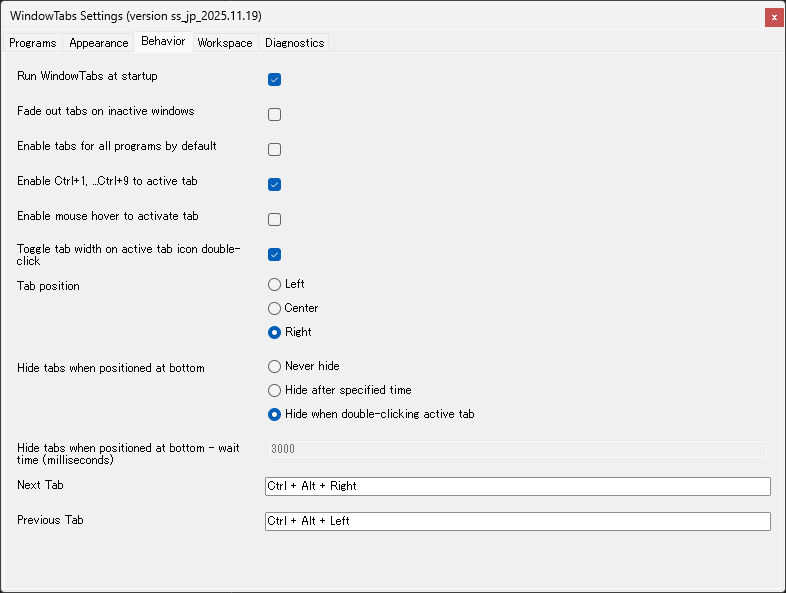

# WindowTabs

WindowTabs はインターフェースを持たない Windows アプリケーションや、異なる実行ファイル間でタブ UI を有効にするユーティリティです。Chrome と Edge をタブで管理、複数の Excel や Word のウィンドウをタブで管理が可能になります。

元々は Maurice Flanagan 氏によって開発され、当時は無料版と有料版が提供されていました。開発者は現在、このユーティリティをオープンソース化しています:

- https://github.com/mauricef/WindowTabs **/ 404 Not Found**

redgis 氏による VS2017 / .NET 4.0 に移行したフォーク、リポジトリはこちら:

- https://github.com/redgis/WindowTabs **/ 404 Not Found**

payaneco 氏のソースコードのフォーク、リポジトリはこちら:
- https://github.com/payaneco/WindowTabs
- https://github.com/payaneco/WindowTabs/network/members
- https://ja.stackoverflow.com/a/53822

leafOfTree 氏もソースコードをフォークしています、リポジトリはこちら:
- https://github.com/leafOfTree/WindowTabs
- https://github.com/leafOfTree/WindowTabs/network/members

そして私 (Satoshi Yamamoto@standard-software) がソースコードをフォークし、VS 2022 Community Edition でコンパイルを行っています。

## 目次
- [バージョン](#バージョン)
- [ダウンロード](#ダウンロード)
- [Installation](#Installation)
- [Usage](#Usage)
- [Features](#Features)
- [Settings](#Settings)
- [Links](#Links)
- [License](#License)
- [Comments](#Comments)

## バージョン

最新のバージョン: **ss_jp_2025.11.24**

詳細な更新履歴と変更ログについては、[version.md](version.md) を参照してください。

## ダウンロード

**対応している OS:** Windows 10、 Windows 11

[releases](https://github.com/standard-software/WindowTabs/releases) ページからビルド済みのファイルをダウンロードできます。

2 つのダウンロードオプションがあります:

- **WtSetup.msi** - 自動インストールとアンインストールをサポートしている Windows インストーラーパッケージ
- **WindowTabs.zip** - 任意の場所で展開して実行可能なポータブル版

提供しているビルドスクリプトを使用して、インストーラー版とポータブル版を自分でビルドすることもできます。

## インストール

### MSI インストーラー版の使用方法 (WtSetup.msi)

1. [Releases](https://github.com/standard-software/WindowTabs/releases) ページから `WtSetup.msi` をダウンロード
2. インストーラーを実行してインストールウィザードに従って操作します
3. インストール先のディレクトリを選択 (既定: Program Files\WindowTabs)
4. デスクトップとスタートメニューにショートカットが自動で作成されます
5. オプションでインストール後に WindowTabs を起動

### ポータブル版の使用方法 (WindowTabs.zip)

1. [Releases](https://github.com/standard-software/WindowTabs/releases) ページから `WtSetup.msi` をダウンロード
2. アーカイブを任意の場所に展開します
3. `WindowTabs.exe` を実行
4. WindowTabs がバックグラウンドで実行され、トレイアイコンが表示されます

WindowTabs をスタートアップ時に起動:
- Enable "Run at startup" option in the Settings > Behavior tab

## 使用方法

1. `WindowTabs.exe` を実行
2. Window をグループ化すると自動でタブが表示されます
3. トレイアイコンを右クリックで設定にアクセスできます
4. タブを右クリックでタブ固有のオプションにアクセスできます
5. タブをドラッグ&ドロップでウィンドウを整理できます

## 機能

### タブのドラッグ&ドロップ

これは元の WindowTabs の機能から変更されていません。

- Drag tabs to reorder within the same group
- Drag tabs to separate into new windows with preview
- Drop windows to create new tab groups
- Respects tab alignment settings (left/center/right)

### タブの管理

- **Tab Context Menu**: Right-click on tabs to access various options
  - Close tabs (this tab, tabs to the right, tabs to the left, other tabs, all tabs)
  - New window
  - Make tabs wider / Make tabs narrower
  - Rename tab
  - Detach and reposition tab
  - Reposition tab group
  - Detach and link tab to another group
  - Link tab group to another group
  - Settings

### Detach and reposition tab

タブをグループから切り離しとマルチディスプレイのサポートで再配置します:
- Detach at same position
- Move to display edges (right/left/top/bottom)
- DPI-aware percentage-based positioning for correct placement across different DPI displays

### Reposition tab group

Move entire tab group to different display positions:
- Move to current display edges (right/left/top/bottom)
- Move to other displays with edge positioning options
- DPI-aware positioning for correct placement across different DPI displays
- Maintains tab group integrity while repositioning

### Detach and link tab to another group

Detach a single tab from current group and link it to another existing group:
- Shows other groups with tab names and counts
- Adaptive tab name truncation for easy identification
- Display application icons for group recognition
- Disabled when tab group has only one tab

### Link tab group to another group

Transfer all tabs from current group to another existing group:
- Shows other groups with tab names and counts
- Transfers all tabs at once from current group to target group
- Adaptive tab name truncation for easy identification
- Display application icons for group recognition

### ダークモード / ライトモードのメニューテーマ

While light mode is the default, dark mode is also supported for context menus (popup menus) as shown in the screenshots.

- Toggle via "Menu Dark Mode" checkbox in Appearance settings
- Applies to tab context menu and drag-and-drop menus

### マルチディスプレイと高 DPI のサポート

- Multi-display support with proper window positioning
- DPI-aware window placement
- Automatic window resizing when dropped to prevent exceeding monitor dimensions
- Fixed tab rename floating textbox positioning on high-DPI displays

### UWP アプリをサポート

- Supports UWP (Universal Windows Platform) applications
- Automatically handles UWP window Z-order for proper tab visibility
- Maintains tab visibility when working with UWP apps

### 多言語をサポート

- English and Japanese language support
- Runtime language switching without restart
- Switch languages via tray menu

### Disable Feature

Temporarily disable WindowTabs functionality via tray menu:
- **Disable** checkbox in tray icon context menu
- When enabled:
  - Immediately hides all existing tab groups
  - Stops automatic tab grouping for new windows
  - Disables Settings menu to prevent configuration changes

## 設定

Access settings by right-clicking the tray icon and selecting "Settings" or by right-clicking on a tab and selecting "Settings...".

### プログラムタブ

This feature remains unchanged from the original WindowTabs functionality.

Configure which programs should use tabs and auto-grouping behavior.

### タブの外観

Customize the visual appearance of tabs:
- Height, width, and overlap settings
- Border and text color
- Background colors (active, normal, highlight, flash)
- Color theme presets (Light Color, Dark Color, Dark Blue Color)
- Distance from edge settings

### Behavior Tab

Configure tab behavior:
- Tab position (left/center/right)
- Tab width (narrow/wide) default
- Toggle tab width on active tab icon double-click
- Hide tabs when positioned at bottom (never/always/double-click)
- Delay before hiding tabs
- Auto-grouping settings
- Hotkey settings (Ctrl+1...+9 for tab activation)
- Mouse hover activation

### ワークスペースタブ

This feature remains unchanged from the original WindowTabs functionality.

### Diagnostics Tab

This feature remains unchanged from the original WindowTabs functionality.

## Building from Source

### Prerequisites

- Visual Studio 2022 Community Edition (またはそれ以上)
- WiX Toolset v3.11 またはそれ以降 (MSI インストーラー版のビルド)

### ビルドスクリプト

プロジェクトのルートに 2 種類のビルドスクリプトが用意されています:

- **build_installer.bat** - MSI インストーラー版をビルド (WtSetup.msi)
  - 出力: `exe\installer\WtSetup.msi`

- **build_release_zip.bat** - ポータブル ZIP 版の配布パッケージをビルド
  - 出力: `exe\zip\WindowTabs.zip`

必要なバッチファイルを実行で配布パッケージを作成することができます。

## リンク

### 日本語のリソース

c# - WindowTabs というオープンソースを改良してみたいのですがビルドができません。何か必要なものがありますか？ - スタック・オーバーフロー  
https://ja.stackoverflow.com/questions/53770/windowtabs-というオープンソースを改良してみたいのですがビルドができません-何か必要なものがありますか

全Windowタブ化。Setsで頓挫した夢の操作性をオープンソースのWindowTabsで再現する。 #Windows - Qiita  
https://qiita.com/standard-software/items/dd25270fa3895365fced

## ライセンス

This project is open source. See the original repository for license information.

## クレジット

- オリジナルの開発者: Maurice Flanagan
- フォークの貢献者: redgis、payaneco、leafOfTree
- 現在のメンテナー: Satoshi Yamamoto (standard-software)

## コメント

If you have any issues, please contact us via GitHub Issues or email: standard.software.net@gmail.com

Thanks to Claude Code's hard work, development has progressed significantly. However, I've given up on making the Settings dialog dark mode-compatible as I couldn't get it to look right. I'm hoping someone might fork this project and improve it.
